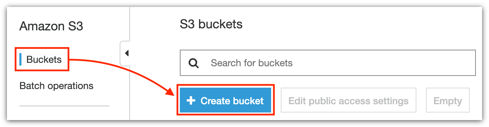
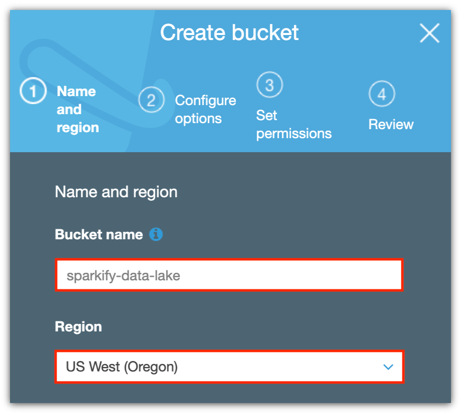
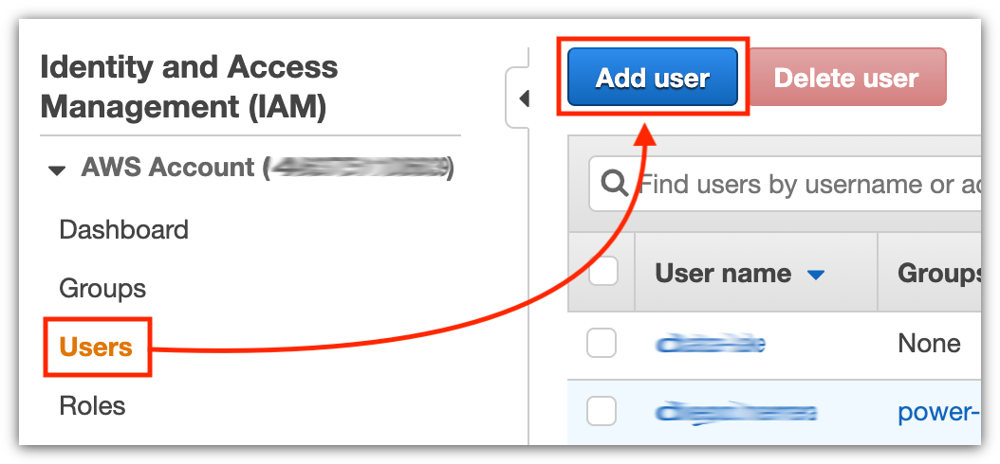
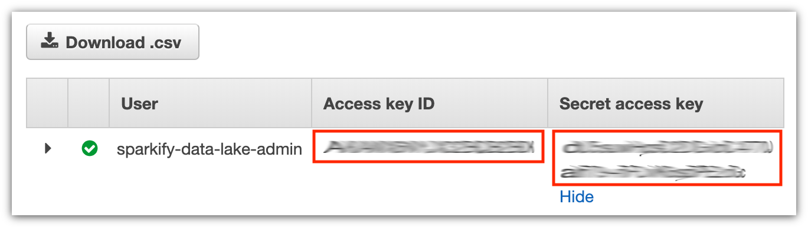
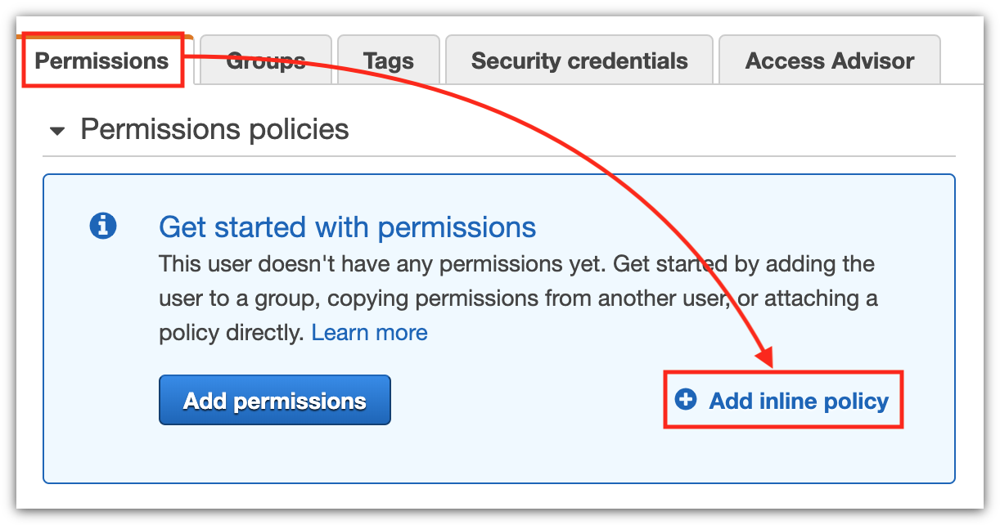
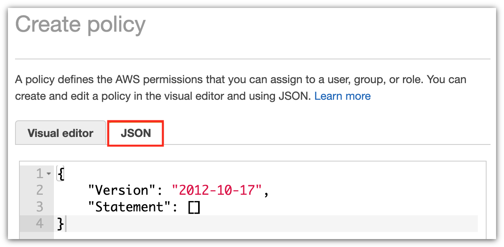
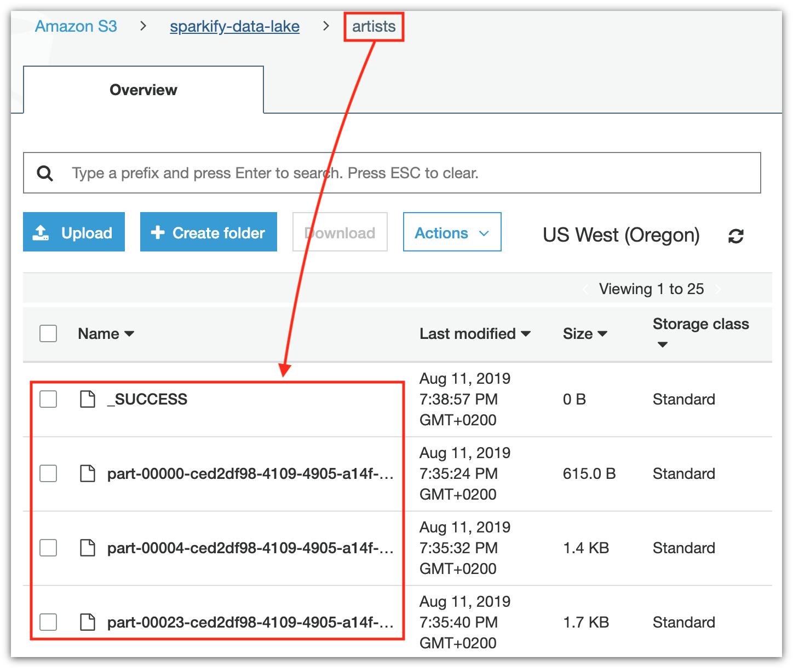

# Project: Data Lake

A music streaming startup, Sparkify, has grown their user base and song database even more and want to move their data warehouse to a data lake. Their data resides in S3, in a directory of JSON logs on user activity on the app, as well as a directory with JSON metadata on the songs in their app.

As their data engineer, you are tasked with building an ETL pipeline that extracts their data from S3, processes them using Spark, and loads the data back into S3 as a set of dimensional tables. This will allow their analytics team to continue finding insights in what songs their users are listening to.

You'll be able to test your database and ETL pipeline by running queries given to you by the analytics team from Sparkify and compare your results with their expected results.

## Table of contents

- [Structure](#structure)
- [Requirements](#requirements)
  - [Preparing AWS](#preparing-aws)
    - [Creating a bucket](#creating-a-bucket)
    - [Creating an administrator user](#creating-an-administrator)
  - [Cloning the repository](#cloning-the-repository)
  - [Creating the virtual environment](#creating-the-virtual-environment)
- [How to use](#how-to-use)
  - [Running the ETL](#running-the-etl)

---

## Structure<a name="structure"></a>

This tree shows the repository structure. Only the project's main files are described.

```
.
├── images
│   ├── iam-create-user-01.png
│   ├── iam-create-user-02.png
│   ├── iam-create-user-03.png
│   ├── iam-create-user-04.png
│   ├── iam-create-user-05.png
│   ├── s3-artists-parquet.png
│   ├── s3-create-bucket-01.png
│   └── s3-create-bucket-02.png
│   └── s3-create-bucket-03.png
├── src
│   ├── pipelines
│   │   ├── __init__.py
│   │   ├── artists.py             # Artists table pipeline
│   │   ├── base.py                # Pipeline common code
│   │   ├── cache.py               # Dataframes cache
│   │   ├── songplays.py           # Songplays table pipeline
│   │   ├── songs.py               # Songs table pipeline
│   │   ├── time.py                # Time table pipeline
│   │   └── users.py               # Users table pipeline
│   ├── config.py                  # Application config manager
│   ├── etl.py                     # ETL pipeline script
│   └── sparkify.cfg               # Application config file
├── .editorconfig
├── .gitignore
├── README.md
└── requirements.txt
```

---

## Requirements<a name="requirements"></a>

It is assumed that the tools below are properly installed locally:

- [Python](https://www.python.org/) is a programming language that lets you work quickly and integrate systems more effectively. Versión 3.x is required.
- [pip](https://pip.pypa.io/en/stable/) is the package installer for Python.
- [Virtualenv](https://virtualenv.pypa.io/en/latest/) is a tool to create isolated Python environments.
- [Amazon Web Services](https://aws.amazon.com/) is the world's most comprehensive and broadly adopted cloud platform, offering over 165 fully featured services from data centers globally.

### Preparing AWS<a name="preparing-aws"></a>

Before running the pipelines that will load the source data into our data lake, we must tune up some things in our AWS account.

#### Creating a bucket<a name="creating-a-bucket"></a>

We are using [Amazon S3](https://docs.aws.amazon.com/s3/index.html) as data lake, so we must first create the bucket in which the data will be stored.

Open the AWS console, log into your account and go to [S3](https://s3.console.aws.amazon.com/s3/home). Choose _Buckets_ from the left side menu, and then click the button _Create bucket_.



Then choose a name for the bucket; remember to check the naming rules [here](https://docs.aws.amazon.com/AmazonS3/latest/dev/BucketRestrictions.html#bucketnamingrules). For the region we will use _US West (Oregon)_, the same as the source data bucket.



For other options and permission we will keep the default values. Just follow the steps and confirm the bucket creation.

Once the bucket is created, select it from the main list. A popup box will appear from the right, showing some interesting properties regarding the selected bucket. Click the button _Copy the Bucket ARN_, because we will use it in a couple of minutes.


#### Creating an administrator user<a name="creating-an-administrator"></a>

Now go to [IAM](https://console.aws.amazon.com/iam/home#/users). Choose _User_ from the left side menu, and then click the button _Add user_.



Fill in the _User name_ box, and also mark the _Programmatic access_ checkbox.


Do not add any permission to the user; just go to the end of the wizard, when the credentials are shown.



Copy the _Access key ID_ and the _Secret access key_ directly from the site and paste them in the application configuration file `src/sparkify.cfg`: do it in the proper configuration keys:

```ini
...
ACCESS_KEY_ID = the-access-key-id
SECRET_ACCESS_KEY = the-secret-access-key
...
```

*Important:* never share this credentials to anyone, your AWS account can be compromised.

It's time to add some permissions to the user. Go to the _Users_ menu and navigate to the user _Summary_. Here you can select the tab _Permissions_ and click the button _Add inline policy_.



The inline policy can be created easily using a visual editor, but we will write the JSON document corresponding the policy instead. Select the tab _JSON_.



And now copy and paste the JSON below into the policy editor.

```json
{
    "Version": "2012-10-17",
    "Statement": [
        {
            "Effect": "Allow",
            "Action": [
                "s3:ListBucket"
            ],
            "Resource": [
                "arn:aws:s3:::udacity-dend"
            ]
        },
        {
            "Effect": "Allow",
            "Action": [
                "s3:GetObject"
            ],
            "Resource": [
                "arn:aws:s3:::udacity-dend/log-data/*",
                "arn:aws:s3:::udacity-dend/song-data/*"
            ]
        },
        {
            "Effect": "Allow",
            "Action": "s3:ListBucket",
            "Resource": [
                "data-lake-bucket-arn"
            ]
        },
        {
            "Effect": "Allow",
            "Action": [
                "s3:GetObject",
                "s3:DeleteObject",
                "s3:PutObject"
            ],
            "Resource": [
                "data-lake-bucket-arn/*"
            ]
        }
    ]
}
```

The permissions are listed in the `Statement` collection:

- The user can list the source bucket
- The user can get all the objects stored in the `log-data` and `song-data` folders
- The user can list the data lake bucket
- The user can get, create and delete all the objects stored in the data lake bucket

In the last two permissions, make the `Resource` to point to the data lake: replace the text `data-lake-bucket-arn` with tha actual bucket ARN that we get [before](#creating-a-bucket). Once the policy is ready, click the button _Review policy_ and then _Save changes_.


### Cloning the repository<a name="cloning-the-repository"></a>

The first step is to clone this repository. Just type the following command in your Terminal:

```bash
# Clone the repository...
git clone https://github.com/vermicida/data-lake.git

# ...and move to its directory
cd data-lake
```

### Creating the virtual environment<a name="creating-the-virtual-environment"></a>

Once the project is cloned, you must create a new virtual environment for it. You may have multiple Python versions installed, so it's important to specify the correct one with the `--python` argument. The code on this repository has been successfully tested over Python 3.6, but it must work on any Python 3 version; set the version that applies to your case in the following commands:

```bash
# Create the virtual environment...
virtualenv --python python3.6 project-env

# ...and activate it
source project-env/bin/activate
```

It's time to install the project's dependencies. You will use `pip` to do this job:

```bash
pip install -r requirements.txt
```

It will be ready in a minute.

---

## How to use<a name="how-to-use"></a>

Here are listed the steps to follow in order to make the ETL pipeline work.

### Running the ETL<a name="running-the-etl"></a>

This step will test your patience: it can takes a few hours to complete. It performs the actions described below:

1. Create a Spark session.
2. Read the _song data_, stored in S3, into a dataframe. **Note:** I decided to take just a slice of this data because of the slowness of the writting process that comes later. Instead of get all the JSON files, it just take those from partition `A/A/A`.
3. Transform the song data to create the `songs` dimension table and store it back in S3 in Apache Parquet format.
4. Transform the song data to create the `artists` dimension table and store it back in S3 in Apache Parquet format.
5. Read the _log data_, stored in S3, into a dataframe.
6. Transform the log data to create the `users` dimension table and store it back in S3 in Apache Parquet format.
7. Transform the log data to create the `time` dimension table and store it back in S3 in Apache Parquet format.
8. Transform the song and log data to create the `songplays` fact table and store it back in S3 in Apache Parquet format.

Run this command:

```bash
python etl.py
```

Now better go to eat something, take a nap, or watch the last episode of Money Heist.

When the ETL process ends, go to your data lake bucket and verify that it worked like expected. The image below shows a sample of the `artists` table in Apache Parquet format.


